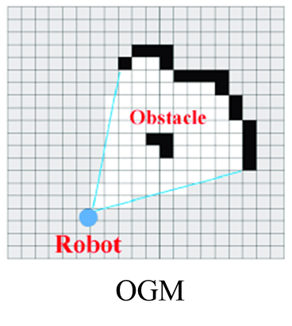

# Mapping

### # Introduction

An accurate representation of the local environment is critical to the effectiveness of mobile robot navigation \cite{lan2021survey,mondal2021offline,yuan2021survey,cui2016search}. Especially, the distance information to nearby obstacles is a must in many motion planning algorithms \cite{ratliff2009chomp,zhou2019robust, arora2021environment}. To that end, OGMs and EDTs are often used to bridge environment representation and planning. Both the OGM and EDT are voxel maps. In an OGM, each voxel records the probability of being occupied by an obstacle. An EDT records the distance information from each voxel to the nearest obstacle. Typically, a local EDT is required to be updated at high frequency for real-time performance of the local planner, while a global EDT is queried less frequently by the global planner.


<figure><figcaption></figcaption></figure>

<figure><figcaption></figcaption></figure>

Motivated by the fast demand in real-time applications for small robots, such as small UAVs and UGVs, we develop an innovative and effective approach to increase the efficiency and accuracy of the mapping process through massive-scale parallelization. It is designed for the navigation purposes of a mobile robot and allows an incremental map to be constructed with dynamically adjustable map size.

### # System architecture

The mapping system can be divided into three stages: OGM construction, batch EDT, and global EDT integration.

<figure><figcaption></figcaption></figure>


In the OGM construction stage, the system intakes data from the sensors and builds the OGM. Position and attitude information are usually estimated by localization algorithms, while range measurement can be obtained from onboard range sensors. {The range measurement is then integrated into the global OGM as occupancy probabilities by parallel implementations of ray casting and volumetric projection.}

In the batch EDT stage, the parallel EDT algorithm transforms the OGM in the euclidean distance metric. Domain knowledge, such as pre-built OGM or pre-defined forbidden zones, can also be incorporated into the EDT process. The algorithm scans each dimension in turn and calculates the distance value for each voxel.

Finally, in the global EDT integration stage, the EDT in the local area is integrated into the hash table that stores global EDT. After identifying the proper sources, the parallel wavefront is utilized to propagate actual distance values over both the local and global EDT. Hence the batch EDT is updated with global observation, and the history can be preserved in the hash table.

### &#x20;Implementation

code: \[GIE-Mapping]\([https://github.com/JINXER000/GIE-mapping](https://github.com/JINXER000/GIE-mapping))


### Supported data input:

* Any sensor outputs pointcloud (e.g., OS32 LiDAR, Mid360)
* Depth camera
* 2D LiDAR
* 3D LiDAR
* Priori knowledge

The current implementation of voxel hashing references [this repo](https://github.com/xkjyeah/vhashing). We plan to improve the efficiency of this part by adopting more efficient data structures of GPU hash table.

## Installation

### Prerequisite

1. This project runs CUDA and requires a computer with **Nvidia GPU**. We have successfully tested this project on CUDA 9.0, 10.2, 11.3 and 11.4.
2. Install Ubuntu with ROS. This project has been tested on Ubuntu 16.04 (ROS Kinetic), 18.04 (ROS Melodic) and 20.04 (ROS Noetic).

### Recompile cuTT

cuTT is a library used for faster batch EDT.

```bash
git clone https://gitee.com/jinxer000/cutt_lts.git
cd cutt_lts
rm ./build/*
make 
```

It will create the library itself:

* include/cutt.h
* lib/libcutt.a

Copy the lib file into $(GIE\_folder)/lib.

If it fails to compile, please modify the Makefile according to [this website](https://arnon.dk/matching-sm-architectures-arch-and-gencode-for-various-nvidia-cards/).

### Seperate compilation lib

Search your computer and find the _libcudadevrt.a_ (e.g., /usr/local/cuda-10.2/targets/x86\_64-linux/lib/libcudadevrt.a).

Copy the lib file into $(GIE\_folder)/lib.

### Compile

Download source code from github:

```bash
mkdir GIE_ws & cd GIE_ws
mkdir src & cd src
git clone https://github.com/JINXER000/GIE-mapping.git
cd ..
sudo chmod 777 ./CMakeLists.txt
catkin_make
source devel/setup.bash
```

### Launch the mapper

#### Caution

* If the local size is too large, an "invalid argument" error will be thrown due to CUDA does not support such a large thread-block.
* The parameters _bucket\_max_ and _block\_max_ has to be increased if you are doing large-scale and fine-resolution mapping. The initialization time may be longer.
* The software is being actively updated, and there may be inconsisitency between our paper and the actual implementation. The most updated profiling data can be viewed in our [supplementary video](https://youtu.be/1g4AnkHAiZ8).

Please kindly leave a **star** if this software is helpful to your projects :3

### Try with datasets

#### UGV-corridor

Please download the dataset [here](https://drive.google.com/file/d/1COHl\_jEaWHl09kPolfXgYs66\_YTrb3uH/view?usp=sharing).

```bash
roslaunch GIE ugv_dataset.launch
rosbag play ugv-cut-filter.bag --clock __name:=profile_bag
```

#### Cow-lady

Please download the dataset [here](http://robotics.ethz.ch/\~asl-datasets/iros\_2017\_voxblox/data.bag).

```bash
roslaunch GIE cow_dataset.launch
rosbag play data.bag --clock __name:=profile_bag
```

#### UAV-2DLiDAR

Please download the dataset [here](https://drive.google.com/file/d/1ns8DkFRKN-9JuG-FQcYzLzghA18B7m4c/view?usp=sharing).

```bash
roslaunch GIE scan2D.launch
rosbag play uav-2dlidar-cut-filter.bag --clock 
```

#### UAV-depthcam

Please download the dataset [here](https://drive.google.com/file/d/16M\_smQXJOCzElDDeMadCClYup6jEZ9ec/view?usp=sharing).

```bash
roslaunch GIE depthcam_iris.launch
rosbag play uav-depth.bag --clock 
```

#### UAV-3DLiDAR

Please download the dataset [here](https://www.dropbox.com/s/08vjsaqw6c1ppmv/hector\_straight.bag?dl=0).

Use volumetric projection:

```bash
roslaunch GIE uav_laser3d.launch
rosbag play hector_straight.bag --clock 
```

Use parallel ray casting:

```bash
roslaunch GIE uav_raycast.launch
rosbag play hector_straight.bag --clock 
```

### Try on your own robot

Simply remap the input data in volumetric\_mapper.cpp to your own sensor topics!

Remember to set _use\_sim\_time_ parameter in each launch file as **false** in the real world.

#### Speed up tricks

* Turn off Rviz during the run since it will occupy a large amount of GPU resources.
* Disable both _display\_glb\_edt_ and _display\_glb\_ogm_ parameter. Hence the GPU hash table won't be streamed to CPU at every iteration.
* Decrease the parameter _cutoff\_dist_ to a small number (e.g., 2m).
* Turn on _fast\_mode_ parameter. It will disable wavefront A and wavefront B (please see details in our [paper](https://ieeexplore.ieee.org/abstract/document/9782137)). If working in confined space, (e.g., Cow-Lady dataset), the accuracy is nearly the same as the original mode.

#### Integrate with motion planners

Please set _for\_motion\_planner_ parameter as true. It makes the current robot position valid and observed.

Our system publishes the EDT surround by the robot as CostMap.msg in the topic "cost\_map". Each voxel contains visibility information and the distance value. If your motion planning package are not implemented together with GIE, then you can only access the local EDT information by subscribing to the topic "cost\_map".

To access the global EDT directly, you are recommended to implement a GPU-based motion planner together with GIE-mapping. Each voxel can be retrieved by using device function _get\_VB\_key()_ and _get\_voxID\_in\_VB()_. In this way, the _display\_glb\_ogm_ parameter can be _false_, saveing you tons of time.

If you are using a CPU-based planner, you can retrieve the voxel block ID like this:

```cpp
 int VB_idx =_hash_map->hash_table_H_std.find(blk_key)->second;
```

And voxels inside the block can be visited with _get\_voxID\_in\_VB()_.

## Additional features

#### Frontiers for exploration

The system extracts low-level frontiers for exploration. The data type of **VOXTYPE\_FNT** denotes the voxel that belongs to the low-level frontier. You may need to do some post-process to filter out the noise.

#### Signed distance

Developing

#### Virtual fence

Revise the prebuilt map in parameters.h. Note that obsbbx\_ll and obsbbx\_ur are the lower-left corner and upper-right corner of the flyable region.

#### External observer:

Publish a pointcloud in topic "forbid\_reg\_cloud". If the pointcloud is 3D, please set **is\_ext\_obsv\_3D** as true. Otherwise, the height of external observed obstacle is 0.2m\~2.6m.

## Docker Support

To make the installation and development of GIE-mapping easier, the docker-based installation is introduced for Nvidia Xavier NX. Users only need to pull the image from docker hub, and use the provided scripts to finish the installation easily.

### Docker installation

Users can follow the simplified instructions below or follow the [Official instruction](https://docs.docker.com/engine/install/ubuntu/) and [Post-installation steps for Linux](https://docs.docker.com/engine/install/linux-postinstall/).

1.  Downloads the script from get.docker.com and runs it to install the latest stable release of Docker on Linux

    ```bash
    curl -fsSL get.docker.com -o get-docker.sh
    sudo sh get-docker.sh
    ```
2.  Create the docker group

    ```bash
    sudo groupadd docker
    ```
3.  Add your user to the docker group

    ```bash
    sudo usermod -aG docker $USER
    ```
4.  Log out and log back in so that your group membership is re-evaluated.

    On a desktop Linux environment such as X Windows, log out of your session completely and then log back in.

    On Linux, you can also run the following command to activate the changes to groups:

    ```bash
    newgrp docker 
    ```
5.  Verify that you can run docker commands without sudo

    ```bash
    docker run hello-world
    ```

### GIE-mapping installation

Thanks to the properties of Docker, the installation is very straightforward. Users only need to clone the installation script from the repo and run it in Host BASH and Docker BASH respectively. Then, all the installation steps will be finished.

```bash
git clone https://github.com/ryrobotics/USR_Docker.git
mkdir -p ~/GIE_src
cp ./USR_Docker/ROS-melodic-Xavier/GIE_Dokcer_Install.sh ~/GIE_src/
cd ~/GIE_src
sh GIE_Dokcer_Install.sh host
# Run in the bash of Docker
sh /src/GIE_Dokcer_Install.sh docker
```
