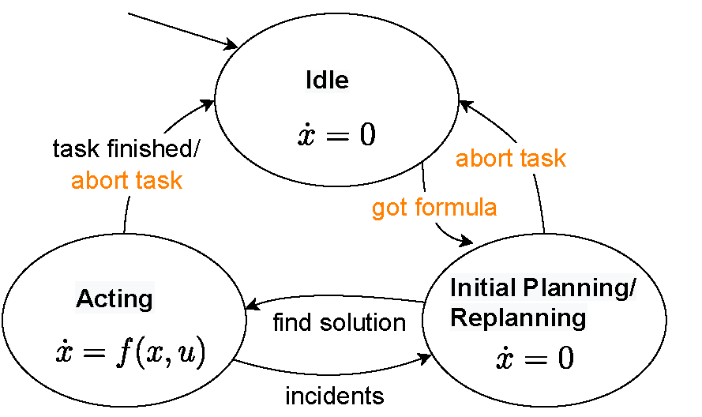
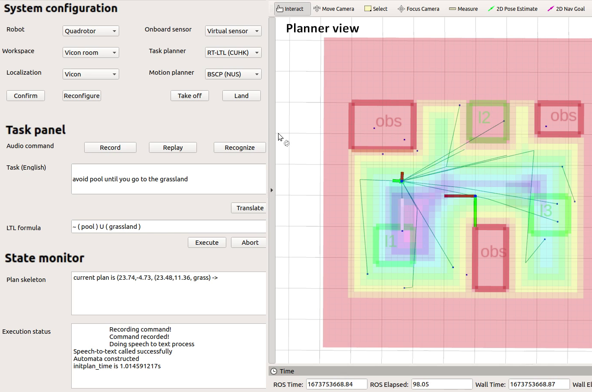

# Task planning

### Math\&Tex notations

A kind reminder: Formula or equations can be edited as below:

$$f(x) = x * e^{2 pi i \xi x}$$

## Introduction

Planning is an indispensable part of any autonomous system as it is responsible for the decision-making and execution of required actions. Task planning helps decide what tasks a robot should do when it should do them, and in what order. This helps the robot work more efficiently. Without good task management, a robot might waste time on less important tasks, or do tasks in a slow way. In contrast to motion planning which focuses on the dynamic and geometric constraints in the continuous domain, task planning works with a highly abstract model in the discrete domain and focuses on generating a coarse task plan.

## System architecture

<figure><figcaption><p>Task planning system structure</p></figcaption></figure>

The GCS (blue part) displays an HMI for users and developers for easier interaction and visualization. Some computation with less real-time requirements runs on the GCS, like audio recording, recognition, and text-to-LTL translation. Through the HMI, users input new orders by speaking the natural language. The audio is further processed into written text by an online speech-to-text service. The instruction sentence is fed into a natural language processing (NLP) module, which infers the underlying LTL formula. Thereafter, an automaton can be easily translated by off-the-shelf software, and is transmitted to the robot onboard computer (red part) via telemetry. Feedback information is forwarded back to GCS and is displayed on the HMI for monitoring and debugging.

##

##

##

## Algorithm Integration - Basic Understanding


<figure><figcaption></figcaption></figure>

The onboard planning and execution loop ~~can be further modeled as a hybrid automaton~~. Upon booting, the robot is in an idle state and waits for a task specified in LTL. The LTL path planner then grows a random exploring tree to search for a sequence of hybrid states that satisfies the specification. As soon as a nominal path is found, the robot begins to follow it with the flow dynamics. During execution, the robot keeps refining the unfinished portion of the plan. If environmental uncertainties are detected to falsify the computed solution, the planner will switch to the planning/replanning mode and brake the vehicle if no valid solution exists. In case the solution is not ideal or it results in danger, users can stop the task planning and execution by sending an \textit{abort} signal through the interface.

## Software Front-end&#x20;

We use RQT to design the user interface for system preference setting, instruction transmission, and graphic visualization. For brevity, we only introduce one of the components on the HMI, task panel, from which users can make high-level decisions and interfere with the task planning. Below lists the main components of the front-end, and the relationship to the back-end is briefly explained. The user interface is tightly coupled with other modules in the software, as it provides hooks for users to call their desired functions or launch the required plugins.

<figure><figcaption><p>HMI of the task planning software</p></figcaption></figure>

### Robot configuration panel&#x20;

To make the system extendable in different scenarios, a robot configuration panel is provided to end-users prior to the tasking. Firstly, the predefined map should be selected from a combo box. A user should then select the robot type according to his/her preference and availability of hardware. Afterward, onboard sensors should be selected for perception and localization purposes. So far, choices for planning and perception module are pruned, and the user has to choose among valid algorithms for navigation, such as localization and motion planning. Once the confirm button is clicked, the GCS triggers a service to launch plugins deployed on the vehicle side.

### Task panel&#x20;

Although LTL provides a way to instruct robots without programming, it is still non-intuitive to specify commands into an LTL formula. By taking advantage of speech recognition and natural language processing technology, we design a task panel that is inclusive for users with different levels of background knowledge. Expert users who are familiar with LTL grammar can directly express the task with an LTL formula. For those non-specialists, the panel provides an interface for natural language inputs with written or spoken text. Let the vocabulary be the whole set of atomic propositions labeled on regions of interest Π in the domain knowledge. Combined with the vocabulary, the algorithm translates the English sentences into an LTL specification. In the current implementation, we use Baidu speech recognition to transfer the audio to text, and an NLP network to translate natural language into LTL formulae. Other task assignment methods, such as inputting the command or LTL formulae in text, are also supported in the panel.

### Execution monitor

The rest of the space on the interface is used to provide real-time feedback to users. The Planner skeleton text box displays the planned path by showing the corresponding trace. Other important notices indicating the execution status are printed in the Execution status text box. The right part of the UI is Rviz, which shows ROS messages which can be visualized directly. Some interactions, such as goal setting, are realized in this panel.


## Code Structure

* formula\_parser: LTL translation
* utils: Files for visualization and useful data structure
* RTLTL.py: Implementation for real-time LTL path planning algorithm.
* #### [ros\_gazebo\_HMI\_base.py](https://github.com/JINXER000/multiple-task-temporal-logic-planning/blob/master/LTLMP/src/ros\_gazebo\_HMI\_base.py): Base class that is integrated with HMI.
* #### [gazebo\_HMI\_plugin.py](https://github.com/JINXER000/multiple-task-temporal-logic-planning/blob/master/LTLMP/src/gazebo\_HMI\_plugin.py): The executable file. Users may revise parameters according to their preference.&#x20;

## Customization

* The tunable parameters are all in gazebo\_HMI\_plugin.py.&#x20;

## System Requirements


*   ## install

    ###

**3rd party dependancies**

```
pip install numpy networkx itertools matplotlib ply pybullet
```

**ltl2dfa**

```
sudo apt-get install flex -y
sudo apt-get install bison -yx
sudo apt-get install byacc -y
git clone https://github.com/whitemech/LTLf2DFA.git
cd ltlf2dfa
pip install .
```

### ltl2ba

follow&#x20;

`$(PROJECT_PATH)/src/formula_parser/install_ltl2ba/README.txt.`

## Folder configuration

Replace folder name in workspace.py and gazebo\_HMI\_plugin.py. A quick way is to search '/home/joseph/yzchen\_ws'.

## Experiment with the whole system

### \[optional when doing simulation] launch a gazebo environment

### run modules like localization, mapping, and motion planning

```
./start nndp
```

### launch HMI

```
cd /home/joseph/yzchen_ws/task_planning/ltl_interface/
source devel/setup.bash
rqt
```

Then open the plugin in rqt: 'LTL task planning'

### launch the teleoperation service

```
cd /home/joseph/yzchen_ws/task_planning/ltl_interface/
source devel/setup.bash
python /home/joseph/yzchen_ws/task_planning/ltl_interface/src/remote_server/src/remote_launch_service.py
```

### launch the LTL planner

```
python gazebo_HMI_plugin.py
```

### Get ready for the task (e.g., taking off, do system selection in HMI)

### Input the LTL specification by voice or text


## Simulation & Task Management

* ### **How does the task management system utilize the simulation modes (Numerical, SITL, HITL) to ensure safe and efficient task execution?**

##


##

## Updates & Feedback

* ### **How can users ensure they're utilizing the most updated task management features, and where can they submit feedback for continuous system improvement?**
